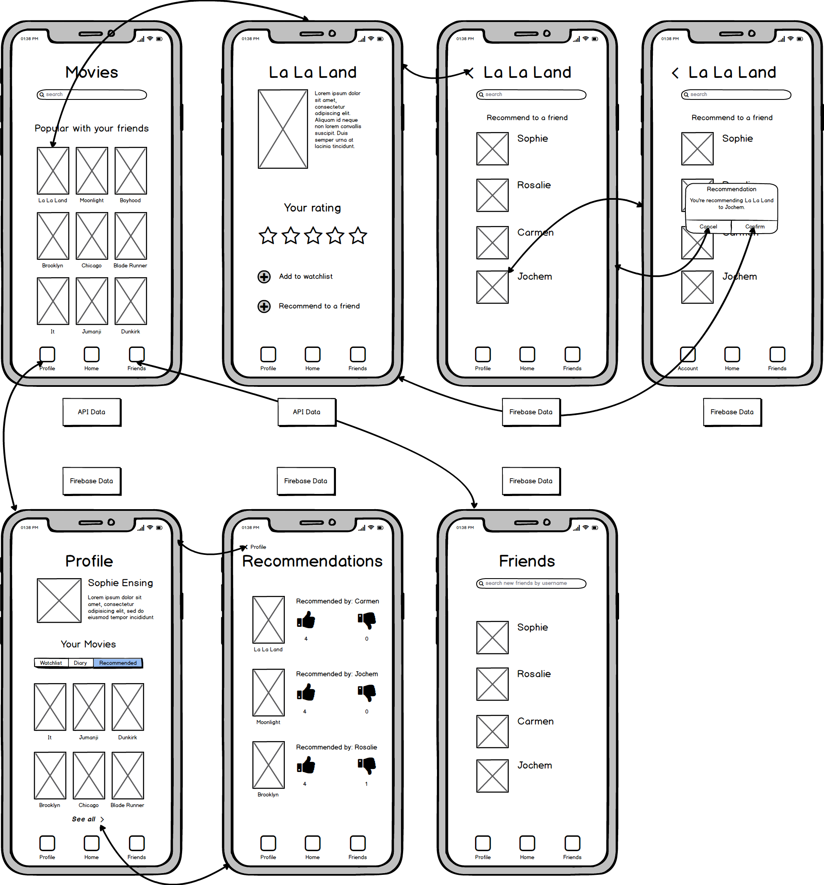

# Programmeerproject - Design

## UI Schetsen

## API
De films worden opgehaald via een API, namelijk de API van the Movie Database: 
https://www.themoviedb.org/documentation/api.

Voor de films krijgt de gebruiker de titel, het jaar, de poster te zien en een korte samenvatting van het plot te zien. Al deze data wordt opgehaald via de API en is opgeslagen in JSON format. 

## Database
De gebruikerdata wordt opgeslagen in Firebase. De gebruiker kan inloggen met een emailadres en wachtwoord. Andere data die van de gebruiker nodig is, zijn de naam en een korte bio. Vervolgens kunnen er films toegevoegd worden die de gebruiker heeft gezien en die de gebruiker zou willen zijn. Het is ook mogelijk dat de gebruiker een film ontvangt die aangeraden wordt door een vriend, ook deze data moet worden opgeslagen, samen met het aantal stemmen voor deze aanrader van andere vrienden. 

## Utility Models
### Structs:
Film Struct

### Functies
* Login
* Aanmaken van account
* Voeg een vriend toe
* Films ophalen via API
* Haal gebruikerdata op (naam, watchlist, recommendations en diary)
* Haal de vrienden van een gebruiker op uit Firebase
* Voeg film toe aan watchlist
* Film aanraden
* Recommendations upvote/downvote geven
