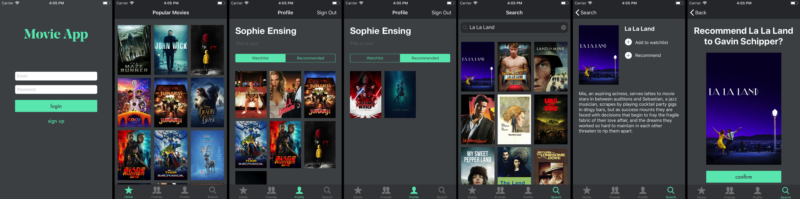

# Programmeerproject
## Rec. - Sophie Ensing

### Doel van de applicatie
Er zijn diverse apps beschikbaar om een watchlist bij te houden voor films. Wat hier ontbreekt is de mogelijkheid tot interactie tussen gebruikers. In het dagelijks geven vrienden elkaar vaak aanbevelingen op het gebied van films, maar de keuze maken voor een film is toch vaak lastig. De app Rec. biedt hiervoor een oplossing door gebruikers de mogelijkheid te geven om niet alleen films aan een watchlist toe te voegen, maar ook aan te raden aan vrienden.

Bij deze app is het nodig om in te loggen. De gebruiker ziet als eerste een overzicht van de populaire films van dit moment. Op het profiel scherm wordt de gebruikersnaam getoond en is ook te zien welke films er op de watchlist en de recommended lijst staan. Ook is er een zoekfunctie beschikbaar in de app. Als er op een film geklikt wordt ergens in de app, komt de gebruiker op een aparte pagina. Hier is het plot van de film te zien. Het is ook mogelijk hier om de film toe te voegen aan de watchlist of aan te raden aan een vriend.

### Copyright
* Voor de applicatie is gebruikt gemaakt van de API van the Movie Database (https://www.themoviedb.org/)
* Voor de tabbar iconen zijn iconen gebruikt van icons8 (https://icons8.com/ios-icons/)
* Voor het inladen van afbeeldingen van internet en het orderen van een collection view is een YouTube tutorial gebruikt van Yp.py (https://www.youtube.com/watch?v=hPJaQ2Fh7Ao&feature=youtu.be)
