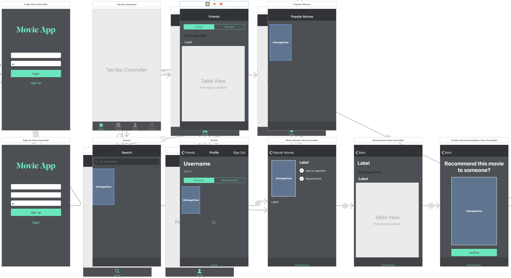

# Final Report
## Beschrijving
Er zijn diverse apps beschikbaar om een watchlist bij te houden voor films. Wat hier ontbreekt is de mogelijkheid tot interactie tussen gebruikers. In het dagelijks geven vrienden elkaar vaak aanbevelingen op het gebied van films, maar de keuze maken voor een film is toch vaak lastig. De app Rec. biedt hiervoor een oplossing door gebruikers de mogelijkheid te geven om niet alleen films aan een watchlist toe te voegen, maar ook aan te raden aan vrienden.

## Ontwerp

## Uitdagingen
Het was erg lastig voor mij om de films op een duidelijke manier weer te geven die er ook mooi uitzag. Uiteindelijk heb ik gekozen voor een collection view waarin alleen de posters zichtbaar zijn. Met behulp van tutorials en door veel te proberen is dit uiteindelijk gelukt. Gedurende het project zijn wel mijn doelstellingen aangepast. Het idee was om nog meer interactie te implementeren tussen gebruikers. Het idee was hier dat gebruikers een stem konden uitbrengen op een aangeraden film. Stel persoon A raadt een film aan aan persoon B, dan kan persoon C nog stemmen of hij het er mee eens is of juist niet. Dit leek mij een leuke interactie omdat het in het dagelijks leven soms ook zo kan gaan, maar het toch vaal een uitdaging is om een fiml uit te zoeken. Dit was echter wel vrij complex en daarnaast is het ook niet zeker of gebruikers echt zo veel moeite willen steken in het gebruikern van de app. Daarom is het idee iets simpeler gehouden.

## Later werk
In de toekomst zou het mooi zijn om ook te zorgen dat films beoordeeld kunnen worden. Om deze films weer te geven kan simpelweg op de profielpagina nog een segment toegevoegd worden. Dit was alleen niet meer mogelijk in dit tijdsbestek.

